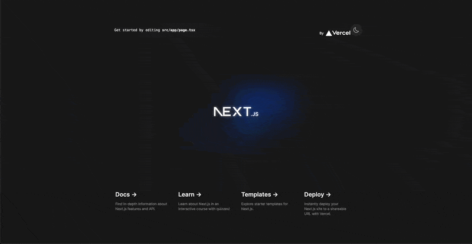

<h1 align="center">
  <h1 align="center">React Theme Switch Animation Hook</h1>
  <p align="center">
  This package provides a hook for toggling dark mode in React applications with a smooth animation effect in TailwindCSS.
  </p>
</h1>

<p align="center">
  <strong>
    <a href="https://minhomega.github.io/react-theme-switch-animation/" target="_blank">Live code demo</a> |
    <a href="https://github.com/minhomega/" target="_blank">Hire me here</a>
  </strong>
</p>

## Demo

<p align="center">
  
</p>

## Notes

- The hook is only available in the browser environment. So if you use NextJS App router or any other framework is use Server Component, you should use this hook in Client Component by adding directive [`use client`](https://react.dev/reference/rsc/use-client)
- Currently working if the project is using TailwindCSS only.

## Features

- Toggles dark mode with an animation effect.
- Smooth animations for theme switching.
- Uses React Hooks for state management.
- Supports TypeScript for enhanced development experience.
- Uses `localStorage` to persist the dark mode state across sessions.
- Provides a React ref that can be attached to any component to trigger the mode change.

## Installation

Install the package using npm or YARN:

```bash
npm install react-theme-switch-animation
```

or

```bash
yarn add react-theme-switch-animation
```

## Usage

Here’s how to use the `useModeAnimation` hook in your React component:

```jsx
'use client'

import React from 'react'
import { useModeAnimation } from 'react-theme-switch-animation'

const MyComponent = () => {
  const { ref, toggleSwitchTheme, isDarkMode } = useModeAnimation()

  return (
    <button ref={ref} onClick={toggleSwitchTheme}>
      Toggle Dark Mode (Currently {isDarkMode ? 'Dark' : 'Light'} Mode)
    </button>
  )
}

export default MyComponent
```

## API

`useModeAnimation` accepts an optional `props` object with the following properties:

| Property          | Type   | Default                         | Description                                |
| ----------------- | ------ | ------------------------------- | ------------------------------------------ |
| `duration`        | number | `750`                           | Duration of the animation in milliseconds. |
| `easing`          | string | `"ease-in-out"`                 | CSS easing type for the animation.         |
| `pseudoElement`   | string | `"::view-transition-new(root)"` | Pseudo-element used for the animation.     |
| `globalClassName` | string | `"dark"`                        | Class name to apply to the root element.   |

Returns an object containing:

- `ref`: React ref for attaching to the component that will trigger the dark mode toggle.
- `toggleSwitchTheme`: Function to toggle dark mode.
- `isDarkMode`: Current state of dark mode (`true` for dark, `false` for light).

## Requirements

- React 16.8 or later (for Hooks support).
- TypeScript for compiling the package during installation.

## Contributing

Contributions are welcome! Please open an issue or submit a pull request with your suggested changes.

## License

MIT
